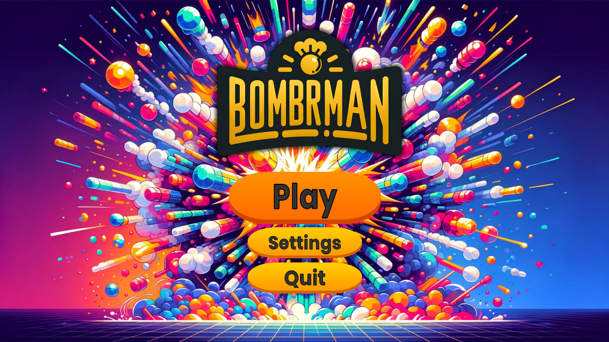
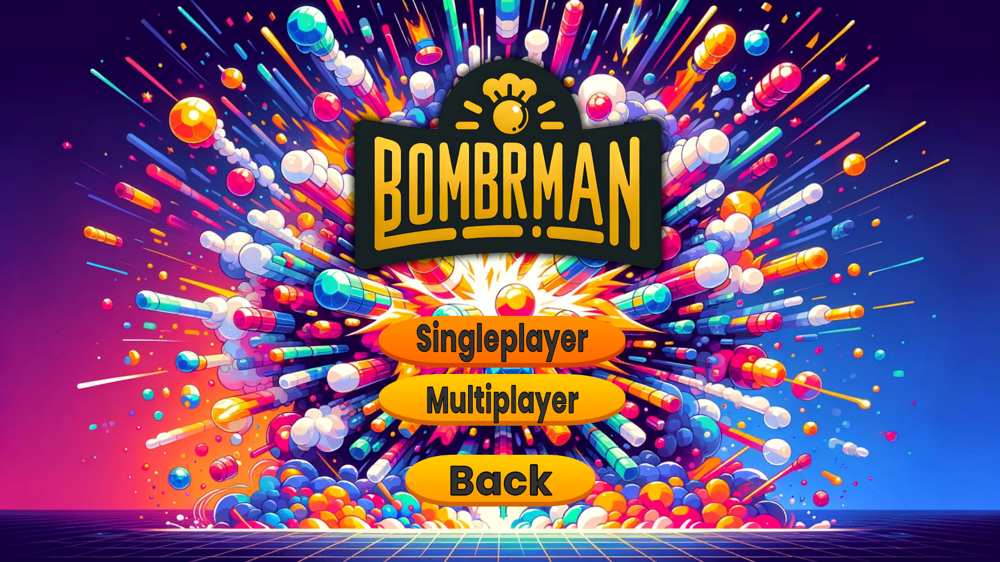
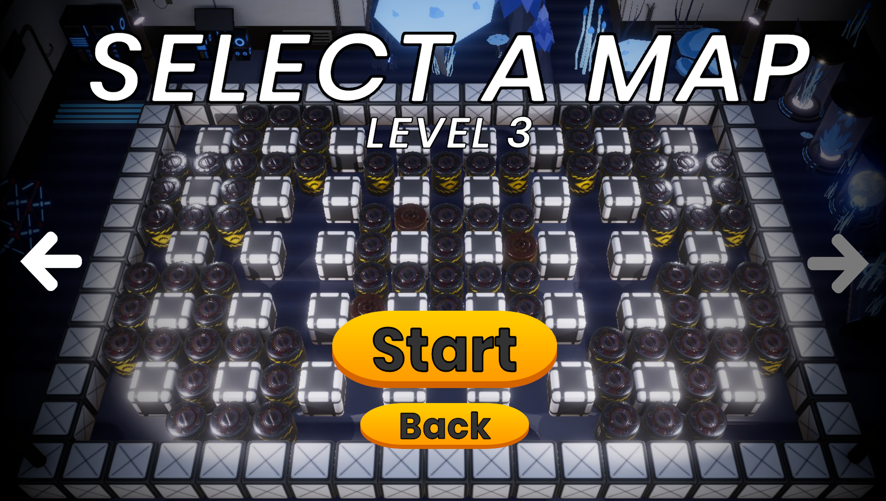
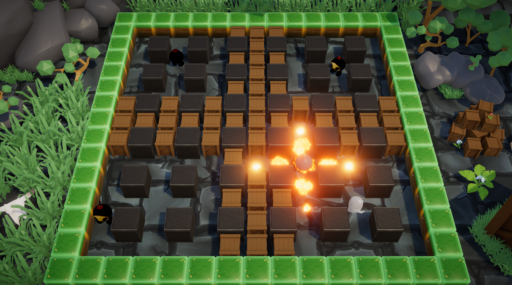
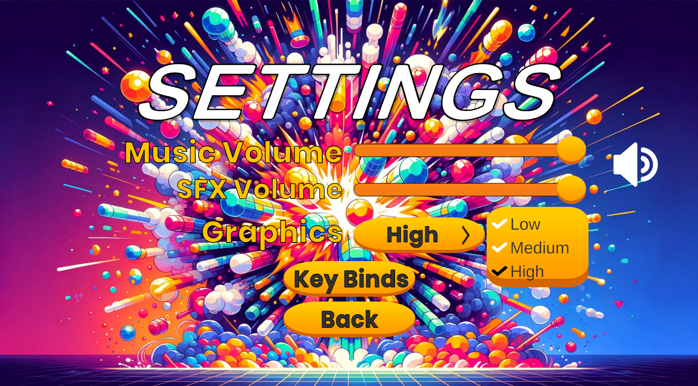
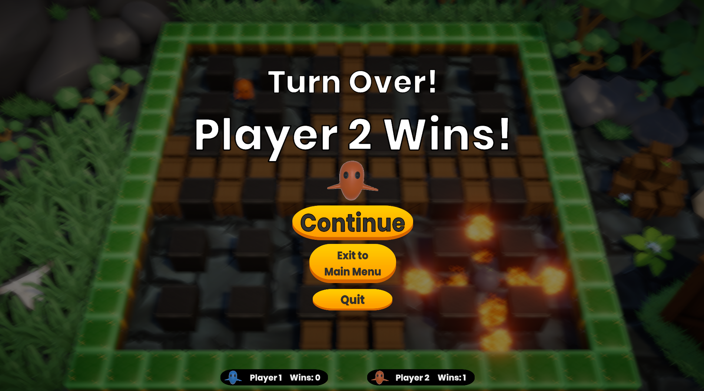

# BombRman - HáromIgazVándor

BombRman egy izgalmas és szórakoztató játék, amely a klasszikus Bomberman játék ihlette 3D-s implementáció. Robbantsd fel az utadat, győzd le az ellenségeidet és gyűjtsd össze a power-upokat, hogy a legerősebb játékossá válj!

## Telepítés
Kövesd az alábbi lépéseket a játék telepítéséhez és buildeléshez:

1. Töltsd le a BombRman legújabb verzióját oldaláról.
2. Csomagold ki a letöltött fájlt egy tetszőleges könyvtárba.
3. Nyisd meg a projektet Unity-ben.
4. Kattints a `File > Build Settings` menüpontra, válaszd ki a cél platformot és kattints a `Build` gombra.
5. Futtasd a létrehozott futtatható fájlt (`BombRman.exe`), hogy elindítsd a játékot.

### Alapvető irányítás

- **Mozgás**: Használd a WASD/nyilakat (Billentyűzet) vagy a Bal Stick/Dpad (Kontroller) a karakter mozgatásához.
- **Bomba elhelyezése**: Nyomd meg a `Shift` billentyűt, vagy a kontroller `X` (PS) / `A` (Xbox) gombját egy bomba elhelyezéséhez.

#### Főmenü

A játék indításakor a főmenü fogad, ahol választhatsz a különböző játékmódok és beállítások között.

#### Játék mód kiválasztása

A főmenüből elérheted a játékmód kiválasztó menüt, ahol egyjátékos vagy többjátékos módok között választhatsz.

#### Szint választás

A játék kezdetekor kiválaszthatod a kívánt pályát, ahol a küzdelem zajlik majd. Több szint közül választhatsz, mindegyik különböző kihívásokkal és elrendezéssel rendelkezik.

### Játékmenet

#### Játék közbeni irányítás

A játékmenet során a karakteredet felülnézetből irányíthatod, bombákat helyezhetsz el és gyűjtheted a power-upokat. 

#### Power-upok

A játéktérben különböző power-upokat találhatsz, amelyek növelik a képességeidet:
- **Több bomba (Fekete)**: Növeli az egyszerre lerakható bombák számát.
- **Robbanás növelése (Piros)**: Növeli a bombák robbanásának hatókörét.

#### Robbanás és győzelem

A bombák felrobbantják az akadályokat és az ellenségeket. A cél, hogy túlélj és legyőzd az összes ellenfelet.

### Beállítások

A beállítások menüben módosíthatod a játék különböző paramétereit, beleértve a zene és a hanghatások hangerejét, valamint a grafikai beállításokat.

### Győzelem és eredmények

A játék végén megjelenik az eredmény, ahol láthatod, ki nyert. 

## Közreműködők

- **Tóth Levente** - [GitHub profil](https://szofttech.inf.elte.hu/ohh5z8)
- **Juhász Áron** - [GitHub profil](https://szofttech.inf.elte.hu/abko47)
- **Török Zoltán** - [GitHub profil](https://szofttech.inf.elte.hu/owwcew)

Reméljük, hogy élvezni fogod a BombRman játékot! Ha bármilyen kérdésed vagy problémád van, kérjük, jelezd a [GitHub Issues](https://szofttech.inf.elte.hu/szofttech-c-2024/group-12/haromigazvandor/-/issues) oldalon.
